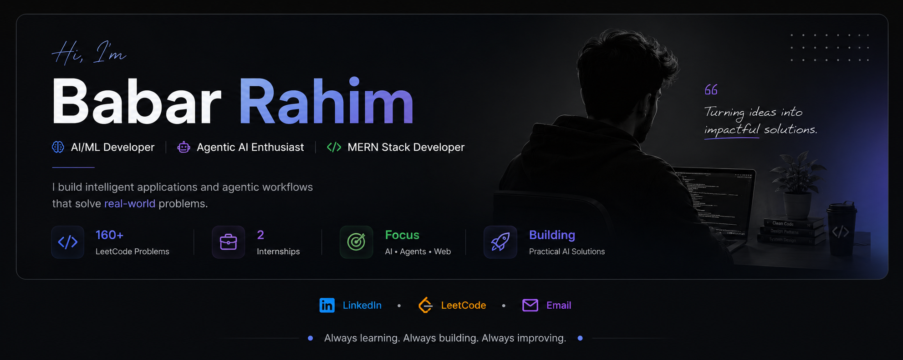

  

  <a href="https://www.linkedin.com/in/babar-rahim-b0882234b/">LinkedIn</a> •
  <a href="https://leetcode.com/u/Babar_Rahim/">LeetCode</a> •
  <a href="mailto:babarrahim256@gmail.com">Email</a>

---

## 🧑‍💻 About Me

I'm Babar Rahim, a Computer Science student and developer focused on
AI/ML, Agentic AI, and full-stack development.

I enjoy building practical software that combines AI with modern
web technologies, with a current focus on:

- 🤖 Agentic AI & AI workflows
- 🧠 LLMs, RAG & AI applications
- 🌐 MERN stack development
- 👁️ Computer Vision & Machine Learning
- 💻 Data Structures & Algorithms

I've gained practical industry experience through internships at
**10Pearls** and **Coderatory**, while continuously building
AI and full-stack projects.

---

## ⚙️ Currently Learning & Building

- 🤖 Agentic AI & multi-step agent workflows
- 🧠 LLM applications, RAG & tool calling
- 🌐 MERN Stack development
- 🏗️ AI-powered automation systems
- 📐 System Design & scalable applications

---

## 🛠️ Tech Stack

### Languages
Python · JavaScript · TypeScript · Java

### AI / ML
PyTorch · TensorFlow · OpenCV · YOLO · LangChain · RAG · LLMs

### AI & Agentic Systems
AI Agents · Agentic Workflows · Tool Calling · Automation

### Web Development
React · Next.js · Node.js · Express.js · FastAPI

### Mobile Development
React Native · Kotlin

### Databases
MongoDB · PostgreSQL · MySQL · Firebase

### Tools & Platforms
Git · GitHub · VS Code · Google Cloud · Vercel

---

## 💼 Experience

### Software Development Intern — Coderatory
**3-Month Onsite Internship**

Gained hands-on experience working in a professional development
environment and building software using modern development practices.

### Virtual Intern — 10Pearls
**Virtual Internship**

Developed practical software development skills while working through
industry-oriented tasks and learning professional development workflows.

---

## 🚀 Featured Projects

### 🤖 Islamic Knowledge Assistant

AI-powered knowledge assistant using Retrieval-Augmented Generation
(RAG) to retrieve relevant information from a curated knowledge base
and provide grounded responses.

**Tech:** MERN · Python · RAG · LLM

[🔗 View Project](https://github.com/Babar-RM/Islamic-Knowledge-assistant)

---

### 🧠 Agentify

AI-powered programming assistant designed to use intelligent agents
to help understand and solve programming problems.

**Tech:** Python · LLM · AI Agents · FastAPI

[🔗 View Project](https://github.com/Babar-RM/Agentify)

---

### 🧴 Skin Analyzer

Machine-learning application that analyzes skin-related images using
computer vision techniques.

**Tech:** React Native · Python · Computer Vision · ML

[🔗 View Project](https://github.com/Babar-RM/Skin-Analyzer)

---

### 📰 NewsSphere

Modern news application for discovering and consuming news through
a responsive web interface.

**Tech:** JavaScript · React · API

[🔗 View Project](https://github.com/Babar-RM/NewsSphere)

---

## 🧩 Problem Solving

- 💻 **160+ LeetCode problems solved**
- 📚 Focused on Data Structures & Algorithms
- 🧠 Continuously improving problem-solving and algorithmic thinking

[🔗 View my LeetCode](https://leetcode.com/u/Babar_Rahim/)

---

## 📊 GitHub Stats

  
  

---

## 🤝 Let's Connect

  <a href="https://www.linkedin.com/in/babar-rahim-b0882234b/">
    LinkedIn
  </a> •
  <a href="https://leetcode.com/u/Babar_Rahim/">
    LeetCode
  </a> •
  <a href="mailto:babarrahim256@gmail.com">
    Email
  </a>

  I'm always interested in learning, building, and collaborating on
  AI and software development projects.

